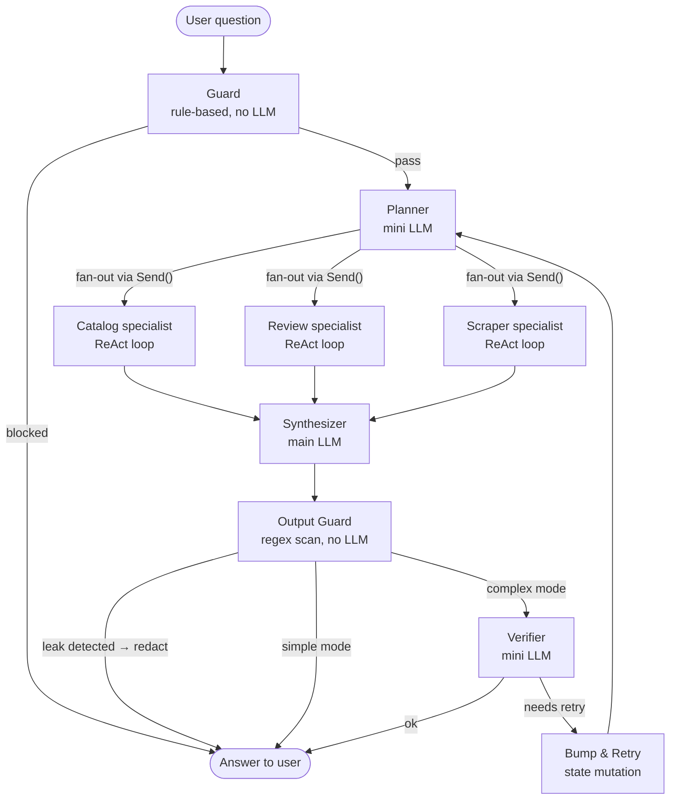
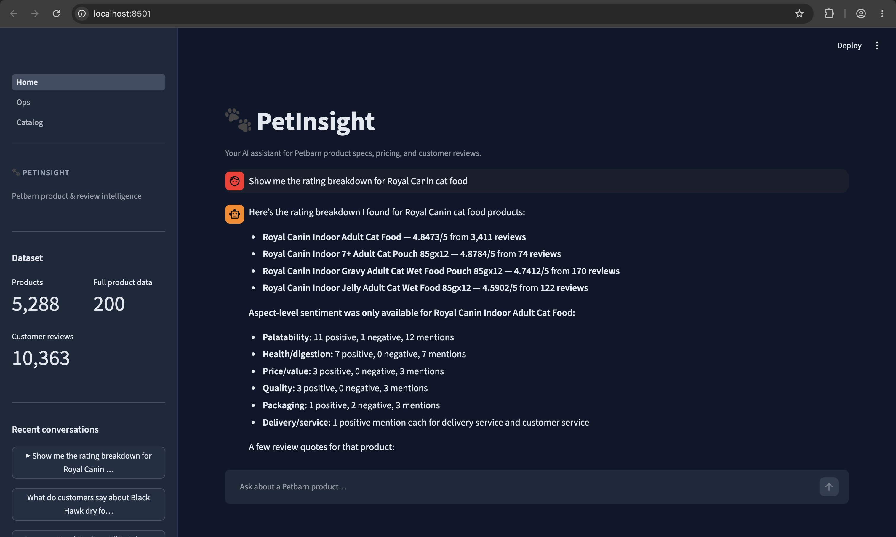
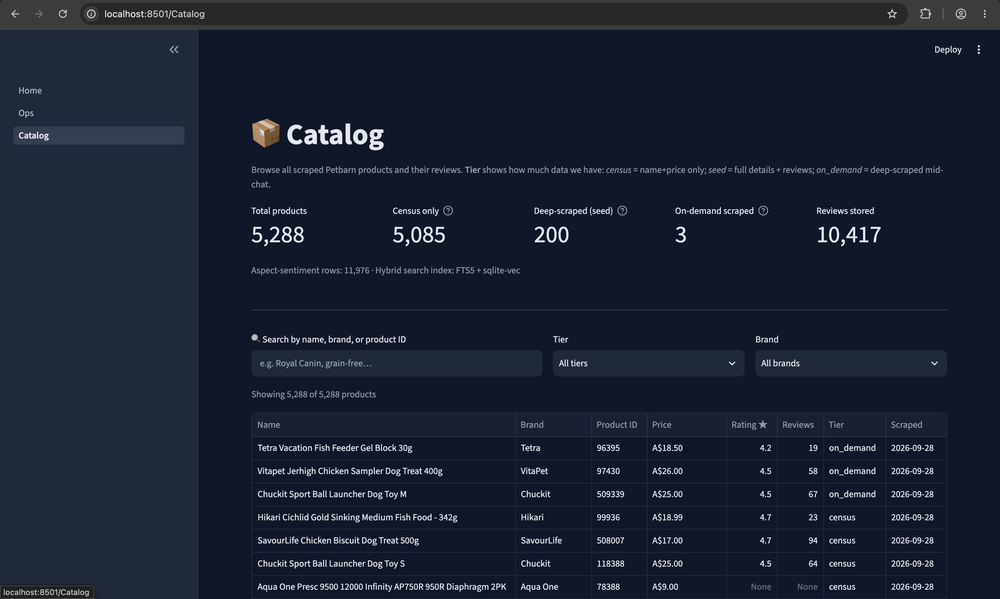
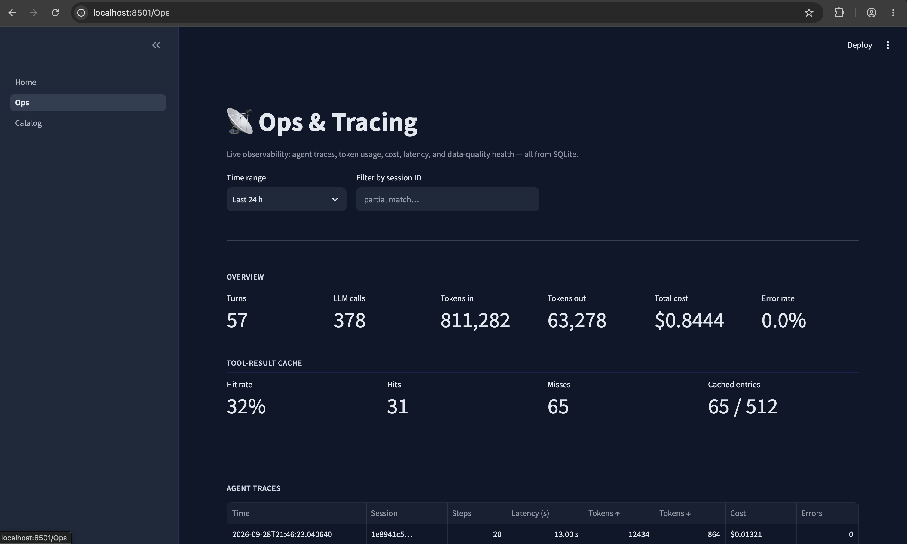

# Petbarn Product & Review Intelligence

> **Live app:** https://petbarn-intel-hkxb4krtwju3zdg2ctqkvc.streamlit.app/ · **GitHub:** https://github.com/manojnm/petbarn-intel

A Streamlit chatbot that answers questions about [Petbarn](https://petbarn.com.au) products and customer reviews by dynamically calling tools over a real, scraped dataset — not canned answers. A [LangGraph](https://github.com/langchain-ai/langgraph) multi-agent pipeline resolves each question, routes it to the right specialist(s), and synthesises a grounded answer.

## Example questions

```
What are people saying about the price and quality of Royal Canin cat food?
Compare GREENIES dental treats for dogs vs Vetalogica Vitarapid — pros and cons.
What are the lowest-rated dog food products and why do customers dislike them?
Show me grain-free cat food under $50 sorted by rating.
What do customers say about the FURminator deshedding tool?
```

---

## Agent graph



### Agent design

| Aspect | Detail |
|---|---|
| **Framework** | LangGraph (`StateGraph` + `Send` fan-out for parallel specialists) |
| **Models** | Mini LLM (guard, planner, verifier, extraction fallback) + main LLM (synthesizer). Configurable via `LLM_PROVIDER` — Azure OpenAI or plain OpenAI, no code change |
| **Specialists** | Catalog, Review Analyst, Scraper — each runs an independent ReAct tool-calling loop |
| **Context** | Last N `(question, answer)` pairs folded into the planner prompt |
| **Tool cache** | 5-min TTL in-process cache on all read-only tools; cleared automatically after any on-demand scrape |
| **Observability** | Every LangGraph node + tool call written to `traces` table; visible in the Ops page |

### Security layers

1. **Guard** — deterministic rule-based blocking for prompt injection, off-topic, secret-extraction, and scrape requests — before any LLM call.
2. **Untrusted envelope** — review and Q&A tool results are prefixed `"untrusted": true`; the Synthesizer is instructed never to treat scraped text as instructions.
3. **Output Guard** — regex-scans the final answer for API keys, PEM blocks, JWTs, and system-prompt substrings before it reaches the user.

Full architecture: [`docs/agent-architecture.md`](docs/agent-architecture.md)

---

## What's in the dataset

Shipped in `data/db/petbarn_intel.sqlite3` — committed to this repo so the deployed app needs zero setup:

| | |
|---|---|
| Catalog census | 5,288 products (GraphQL + Bazaarvoice bulk stats + sitemap cross-check) |
| Deep-scraped ("seed") products | 200 — stratified by pet type/category, including low-rated ones |
| Customer reviews | 10,363 (full text, rating, helpfulness, recommend flag) |
| Aspect-sentiment rows | 11,976 (LLM-extracted: price, quality, palatability, health/digestion, packaging, delivery, service) |
| Review embeddings | 10,363 (`text-embedding-3-large`, 512-dim, hybrid keyword + semantic search) |

Any of the remaining 5,000+ catalog products can be scraped live, on-demand, by the agent's `scrape_product` tool mid-conversation.

---

## Tools the agent can call

| Specialist | Tool | What it does |
|---|---|---|
| **Catalog** | `search_products` | Fuzzy name / brand / category search |
| | `get_product_details` | Specs, price, brand, availability |
| | `compare_products` | Side-by-side comparison of 2–N products |
| | `get_price_history` | Historical price data per SKU |
| | `query_catalog` | Read-only SQL (`sqlglot`-validated) for ad-hoc queries |
| **Review Analyst** | `get_review_stats` | Complete Bazaarvoice rating statistics (never sample-biased) |
| | `analyze_aspects` | Aspect-level sentiment breakdown with mention counts |
| | `search_reviews` | Hybrid BM25 + vector search with quoted citations |
| | `get_vendor_summary` | Petbarn's own AI summary (clearly labelled as secondary signal) |
| | `get_product_qa` | Community Q&A for a product |
| **Scraper** | `scrape_product` | Live on-demand deep scrape (triggered automatically when data is thin) |
| | `diagnose_page` | Explain why a field is missing or incorrect |
| | `get_scraper_health` | Scraper configuration and rate-limit status |

---

## UI screenshots

| Chat — aspect sentiment & rating breakdown | Catalog browse (5,288 products) | Ops & Tracing (cost, cache, traces) |
|---|---|---|
|  |  |  |

**Three pages:**
- **Home (Chat)** — streaming answers, inline charts (rating distribution, aspect sentiment), per-turn agent trace expander showing every LangGraph node and tool call.
- **Catalog** — 5,288-product browser with tier / brand / text filters, per-product drill-down with Reviews / Rating stats / Aspect sentiment tabs.
- **Ops** — per-turn cost, latency, token usage, tool-result cache hit rate, data-quality incidents, scrape run history.

---

## Quickstart (local dev)

```bash
cd poc
python3.11 -m venv .venv && source .venv/bin/activate
pip install -e ".[dev]"
cp .env.example .env      # fill in your credentials — see below
petbarn-intel db init
```

**LLM provider — pick one and fill in `.env`:**

_Option A — Azure OpenAI:_
```
LLM_PROVIDER=azure
AZURE_OPENAI_API_KEY=<your-key>
AZURE_OPENAI_ENDPOINT=https://<your-resource>.openai.azure.com/
AZURE_OPENAI_API_VERSION=2024-12-01-preview
AZURE_CHAT_DEPLOYMENT_MINI=<mini-deployment-name>
AZURE_CHAT_DEPLOYMENT_MAIN=<main-deployment-name>
AZURE_EMBEDDING_DEPLOYMENT=<embedding-deployment-name>
```

_Option B — Plain OpenAI:_
```
LLM_PROVIDER=openai
OPENAI_API_KEY=sk-...
OPENAI_CHAT_MODEL_MINI=gpt-4o-mini
OPENAI_CHAT_MODEL_MAIN=gpt-4o
OPENAI_EMBEDDING_MODEL=text-embedding-3-large
```

Both are fully supported — `config.py`'s `Settings.chat_model_id()` and `embedding_model_id()` route to the right LiteLLM prefix (`azure/` or `openai/`) based solely on `LLM_PROVIDER`. No code changes required when switching.

```bash
streamlit run src/petbarn_intel/app/Home.py   # chatbot
petbarn-intel agent chat                       # same agent, terminal REPL
```

---

## CLI reference

```bash
petbarn-intel config                          # effective settings (no secrets printed)
petbarn-intel db init                         # create/upgrade schema (idempotent)
petbarn-intel db status                       # row counts per table

petbarn-intel scrape census                   # catalog discovery (~5,300 products)
petbarn-intel scrape seed --n 200             # stratified seed selection
petbarn-intel scrape deep                     # deep-scrape the seed set

petbarn-intel enrich aspects                  # LLM aspect-sentiment extraction
petbarn-intel enrich embeddings --concurrency 25  # review embeddings

petbarn-intel agent ping --role mini          # smoke-test the configured LLM
petbarn-intel agent chat                      # interactive REPL

petbarn-intel report coverage                 # per-field extraction completeness
petbarn-intel report incidents [--all]        # open (or all) data-quality incidents
petbarn-intel report cost --limit 20          # per-turn latency / cost / errors
```

The dataset is already built — `scrape`/`enrich` commands are only needed to rebuild it from scratch or extend it.

---

## Deployment

Deployed on **Streamlit Community Cloud**, main file `src/petbarn_intel/app/Home.py`.

Accepts **either Azure OpenAI or plain OpenAI** — set via `LLM_PROVIDER`, no code change needed.

Paste one block into Streamlit Cloud's **Settings → Secrets**:

_Option A — Plain OpenAI:_
```toml
LLM_PROVIDER = "openai"
OPENAI_API_KEY = "sk-..."
OPENAI_CHAT_MODEL_MINI = "gpt-4o-mini"
OPENAI_CHAT_MODEL_MAIN = "gpt-4o-mini"
OPENAI_EMBEDDING_MODEL = "text-embedding-3-large"
```

_Option B — Azure OpenAI:_
```toml
LLM_PROVIDER = "azure"
AZURE_OPENAI_API_KEY = "<your-key>"
AZURE_OPENAI_ENDPOINT = "https://<your-resource>.openai.azure.com/"
AZURE_OPENAI_API_VERSION = "2024-12-01-preview"
AZURE_CHAT_DEPLOYMENT_MINI = "<mini-deployment-name>"
AZURE_CHAT_DEPLOYMENT_MAIN = "<main-deployment-name>"
AZURE_EMBEDDING_DEPLOYMENT = "<embedding-deployment-name>"
```

Template at `.streamlit/secrets.toml.example`. `app/_secrets_bridge.py` bridges Streamlit's `st.secrets` into `os.environ` so the `pydantic-settings` `Settings` class — shared with the CLI and scraper, no Streamlit dependency — picks it up transparently.

**Note on embeddings:** the shipped DB contains review embeddings from `text-embedding-3-large`. The compatibility check in `embeddings.query_embeddings_compatible()` normalises model names (stripping provider prefix and deployment suffix) so `openai/text-embedding-3-large` correctly matches `azure/text-embedding-3-large-<deployment>` — semantic search works out of the box with either provider. Deploying with a different base model (e.g. `text-embedding-3-small`) falls back to keyword-only (BM25) search automatically.

---

## Documentation index

| Doc | What it covers |
|---|---|
| [`docs/agent-architecture.md`](docs/agent-architecture.md) | LangGraph graph, node table, tool table, security layers |
| [`docs/data-model.md`](docs/data-model.md) | Full ER diagram of all 14 tables, column-level reference |
| [`docs/scraping-pipeline.md`](docs/scraping-pipeline.md) | Three-tier scrape, TieredFetcher, BV integration, enrichment |
| [`docs/evaluation.md`](docs/evaluation.md) | Two eval tiers, golden-case table, CI skip logic |
| [`docs/error-handling.md`](docs/error-handling.md) | Per-component error matrix, operator runbook |
| [`docs/decisions/001-sqlite-over-postgres.md`](docs/decisions/001-sqlite-over-postgres.md) | Why SQLite + sqlite-vec + FTS5 |
| [`docs/decisions/002-graphql-attrs-over-html.md`](docs/decisions/002-graphql-attrs-over-html.md) | Why GraphQL API over HTML scraping |
| [`docs/decisions/003-official-vs-sample-ratings.md`](docs/decisions/003-official-vs-sample-ratings.md) | Why official BV rating, not computed sample average |

---

## Production roadmap

Intentionally layered architecture — each of the following can be added independently without rewriting the core agent or scraper.

### Data & scraping

| What | Why it matters |
|---|---|
| **Scheduled re-scrape** (cron / Airflow) | Dataset goes stale; census + seed should refresh weekly or on price-change events |
| **Multi-retailer adapter** | Abstract Petbarn-specific GraphQL + BV behind a `RetailerAdapter` interface; add PetCircle, PetStock, etc. |
| **Change-detection webhooks** | React to sitemap diffs or BV review feed updates rather than polling |
| **Human-in-the-loop bulk crawl approval** | Surface a diff of what has changed and require human approval before kicking off a full re-scrape |

### Agent & LLM

| What | Why it matters |
|---|---|
| **Streaming responses** | Perceived latency drops significantly; Streamlit supports `st.write_stream` |
| **Multi-round verifier** | Current verifier does one retry; a proper critique loop improves accuracy on complex comparisons |
| **Structured output (Pydantic) from specialists** | Replace free-text evidence with typed schemas so the synthesiser has less ambiguity to resolve |
| **Tool-call cost budget** | Extend the existing scrape budget to cap total LLM token spend per turn |

### Infrastructure

| What | Why it matters |
|---|---|
| **Postgres + pgvector** | Move off SQLite for concurrent writes; schema is clean enough to migrate |
| **Redis / Valkey cache** | Replace in-process TTL cache with a shared cache across app instances |
| **CI/CD for the dataset** | Publish SQLite as a versioned artefact to S3/GCS; pull at deploy time instead of committing to git |
| **Observability pipeline** | Langfuse or equivalent for per-trace LLM inspection, latency histograms, prompt versioning |

---

## Tests

```bash
pytest                              # everything
pytest tests/test_tool_cache.py -v  # fast, no credentials needed
pytest -m llm -v -s                 # agent eval suite, needs LLM credentials
```

- `tests/fixtures/` — recon fixtures for the scraper's extraction chain.
- `tests/test_tool_cache.py` — unit tests for hit/miss, TTL expiry, invalidation, LangChain signature preservation. Pure logic, no DB/LLM.
- `tests/test_agent_evals.py` — 10 golden-question evals against the real LLM covering: product lookup, comparison/fan-out, aspect sentiment, catalog SQL, out-of-scope refusal, prompt injection, greeting, honesty on unknown products. Property-based assertions (ground-truth numbers present, right specialist touched) rather than exact-string matching. Marked `@pytest.mark.llm`, auto-skips if no credentials.
