# Data Model

> **ER diagram and table reference for `data/db/petbarn_intel.sqlite3`.**
>
> The SQLite database is the single source of truth for all catalog data, reviews,
> scrape state, and agent traces. It is committed to the repo so the deployed app
> needs zero setup.

---

## Entity-Relationship Diagram

```mermaid
erDiagram

    %% ── Catalog ─────────────────────────────────────────────────
    products {
        TEXT product_id       PK
        TEXT name
        TEXT brand
        TEXT pet_type
        TEXT category
        TEXT subcategory
        TEXT url
        REAL price_min
        REAL price_max
        REAL rating_value
        INT  review_count
        TEXT availability
        TEXT description
        TEXT breadcrumb
        INT  is_seed         "1 = deep-scraped"
        TEXT data_tier       "census | seed"
        TEXT scraped_at
    }

    variants {
        INT  id               PK
        TEXT product_id       FK
        TEXT variant_sku
        TEXT variant_name
        REAL variant_price
        TEXT variant_weight
        TEXT availability
        TEXT scraped_at
    }

    price_history {
        INT  id               PK
        TEXT product_id       FK
        REAL price
        TEXT currency
        TEXT recorded_at
    }

    vendor_summaries {
        INT  id               PK
        TEXT product_id       FK
        TEXT summary_text     "Bazaarvoice AI-generated (labelled as secondary signal)"
        TEXT fetched_at
    }

    %% ── Reviews ─────────────────────────────────────────────────
    reviews {
        INT  id               PK
        TEXT product_id       FK
        TEXT review_id        "Bazaarvoice review ID"
        TEXT author
        INT  rating
        TEXT title
        TEXT body
        INT  helpful_votes
        INT  not_helpful_votes
        INT  is_recommended
        INT  has_images
        TEXT submission_time
        TEXT scraped_at
    }

    review_aspects {
        INT  id               PK
        INT  review_id        FK
        TEXT aspect           "price_value | quality | palatability | health_digestion | packaging | delivery_service | customer_service"
        TEXT sentiment        "positive | negative | neutral | mixed"
        TEXT excerpt
    }

    review_embeddings {
        INT  id               PK
        INT  review_id        FK
        BLOB embedding        "512-dim float32 vector (sqlite-vec)"
        TEXT model_id
        TEXT created_at
    }

    questions {
        INT  id               PK
        TEXT product_id       FK
        TEXT question_text
        TEXT answer_text
        TEXT answered_by
        TEXT submitted_at
        TEXT scraped_at
    }

    %% ── Full-text & vector search ────────────────────────────────
    fts_reviews {
        INT  rowid            "= reviews.id"
        TEXT body
        TEXT title
    }

    vec_reviews {
        INT  rowid            "= reviews.id"
        BLOB embedding        "sqlite-vec index"
    }

    %% ── Scrape operations ────────────────────────────────────────
    scrape_runs {
        INT  id               PK
        TEXT product_id       FK
        TEXT run_type         "census | seed | deep | on_demand"
        TEXT status           "pending | running | ok | error"
        INT  reviews_scraped
        TEXT started_at
        TEXT finished_at
        TEXT error_msg
    }

    field_events {
        INT  id               PK
        TEXT product_id       FK
        TEXT field_name
        TEXT old_value
        TEXT new_value
        TEXT detected_at
    }

    incidents {
        INT  id               PK
        TEXT product_id       FK
        TEXT severity         "low | medium | high"
        TEXT description
        INT  resolved
        TEXT created_at
        TEXT resolved_at
    }

    raw_cache {
        INT  id               PK
        TEXT url
        TEXT content_hash
        TEXT html_path        "file path to raw HTML artefact"
        TEXT fetched_at
    }

    %% ── Agent traces / cost ──────────────────────────────────────
    traces {
        INT  id               PK
        TEXT session_id
        TEXT turn_id
        TEXT node             "guard | planner | specialist | synthesizer | output_guard | verifier"
        TEXT role             "system | user | assistant | tool"
        TEXT content
        INT  prompt_tokens
        INT  completion_tokens
        REAL latency_ms
        TEXT created_at
    }

    %% ── Conversations ────────────────────────────────────────────
    chat_sessions {
        TEXT session_id       PK
        TEXT title
        TEXT created_at
        TEXT updated_at
    }

    chat_messages {
        INT  id               PK
        TEXT session_id       FK
        TEXT role             "user | assistant"
        TEXT content
        TEXT created_at
    }

    %% ── Relationships ────────────────────────────────────────────
    products       ||--o{ variants          : "has"
    products       ||--o{ price_history     : "has"
    products       ||--o{ vendor_summaries  : "has"
    products       ||--o{ reviews           : "has"
    products       ||--o{ questions         : "has"
    products       ||--o{ scrape_runs       : "tracks"
    products       ||--o{ field_events      : "logs"
    products       ||--o{ incidents         : "raises"
    reviews        ||--|| fts_reviews       : "indexed-in"
    reviews        ||--|| vec_reviews       : "indexed-in"
    reviews        ||--o{ review_aspects    : "has"
    reviews        ||--|| review_embeddings : "has"
    chat_sessions  ||--o{ chat_messages     : "contains"
```

---

## Domain overview

The database is split into five logical domains. Each domain maps to a
directory under `src/petbarn_intel/store/` (or `scraping/`).

| Domain | Tables | Purpose |
|---|---|---|
| **Catalog** | `products`, `variants`, `price_history`, `vendor_summaries` | What Petbarn sells; updated by the scraper |
| **Reviews** | `reviews`, `review_aspects`, `review_embeddings`, `questions` | Customer voices; source of truth for all sentiment analysis |
| **Search indexes** | `fts_reviews`, `vec_reviews` | SQLite FTS5 full-text index and sqlite-vec ANN index, kept in sync with `reviews` via triggers |
| **Ops** | `scrape_runs`, `field_events`, `incidents`, `raw_cache` | Scrape provenance, data-quality events, raw HTML cache |
| **Observability** | `traces`, `chat_sessions`, `chat_messages` | Per-turn LLM step trace, token counts, latency |

---

## Table reference

### `products`

One row per unique product in the Petbarn catalog.

| Column | Type | Notes |
|---|---|---|
| `product_id` | TEXT PK | URL slug, e.g. `black-hawk-chicken-&-rice-adult-dog-food` |
| `name` | TEXT | Display name |
| `brand` | TEXT | Manufacturer brand |
| `pet_type` | TEXT | `dog \| cat \| bird \| fish \| small-animal \| reptile` |
| `category` / `subcategory` | TEXT | Petbarn taxonomy |
| `price_min` / `price_max` | REAL | Price range across variants; `NULL` if not yet scraped |
| `rating_value` | REAL | Official Bazaarvoice bulk-stats rating — **never** a sample average |
| `review_count` | INT | Official BV count |
| `is_seed` | INT | 1 = included in the stratified 200-product deep-scrape |
| `data_tier` | TEXT | `census` (metadata only) or `seed` (full detail) |

> **Tier progression:** a product starts as `census` after the catalog scrape.
> When the deep-scraper runs (seed set or agent `scrape_product`), `data_tier`
> is promoted to `seed`.

---

### `variants`

Size/flavour SKU rows. One product typically has 1–8 variants.

| Column | Notes |
|---|---|
| `variant_sku` | Petbarn SKU code |
| `variant_weight` | Weight string (e.g. `"15kg"`) for food products |
| `variant_price` | Per-SKU price; `NULL` if not published |
| `availability` | `in_stock \| out_of_stock \| unknown` |

---

### `price_history`

Append-only time series. The scraper inserts a new row on every deep scrape
only when the price differs from the most recent stored value (change-detection
via `field_events`).

---

### `vendor_summaries`

Bazaarvoice's own AI-generated review summary text for a product. The agent
labels this clearly as a _secondary signal_ — it is Petbarn's opinion of the
reviews, not a ground-truth sentiment score.

---

### `reviews`

Full text of every customer review collected during deep scrapes or on-demand
scraping. The `review_id` is the Bazaarvoice-native identifier, used to
deduplicate across re-scrapes.

Sampling strategy during deep scrape:
- 50 % most-recent
- 30 % lowest-rating (1–2 stars)
- 20 % most-helpful

This stratified sample ensures the agent can answer questions about negative
sentiment even for products where most reviews are positive.

---

### `review_aspects`

LLM-extracted aspect-level sentiment. 11,976 rows across 7 aspects:

| Aspect | Example excerpts |
|---|---|
| `price_value` | "great value for money", "a bit expensive" |
| `quality` | "high quality kibble", "packaging keeps falling apart" |
| `palatability` | "my dog loves it", "fussy cat won't touch it" |
| `health_digestion` | "improved his coat", "caused loose stools" |
| `packaging` | "resealable bag", "arrived crushed" |
| `delivery_service` | "fast shipping", "delayed three times" |
| `customer_service` | "helpful staff", "no response to my query" |

Extracted offline by `petbarn-intel enrich aspects`. Each row links back to
a single `reviews` row via `review_id`.

---

### `review_embeddings`

One 512-dimensional float32 embedding per review, stored as a BLOB.
Computed offline by `petbarn-intel enrich embeddings` with
`text-embedding-3-large` (Azure dev) or `text-embedding-3-small` (deployed
app). The `model_id` column records which model was used.

The `search_reviews` tool checks `embeddings.query_embeddings_compatible()`
at query time and automatically falls back to keyword-only (BM25) search
when the query model does not match the stored embeddings — so the deployed
app (which runs on OpenAI, not Azure) never produces cross-space comparisons.

---

### `fts_reviews` and `vec_reviews`

Two secondary indexes over `reviews.body` kept in sync by SQLite triggers
(no ETL job required):

- **`fts_reviews`** — SQLite FTS5 virtual table. Supports BM25 ranking via
  `MATCH` queries and prefix/phrase search.
- **`vec_reviews`** — sqlite-vec virtual table. Supports approximate nearest-
  neighbour (ANN) vector search over 512-dim embeddings.

`search_reviews` fuses both result sets with **Reciprocal Rank Fusion (RRF)**,
then re-ranks by recency, and returns the top-k rows with verbatim quotes.

---

### `scrape_runs`

Provenance row for every scrape job. `run_type` distinguishes:

| Value | Trigger |
|---|---|
| `census` | `petbarn-intel scrape census` |
| `seed` | `petbarn-intel scrape seed` |
| `deep` | `petbarn-intel scrape deep` |
| `on_demand` | Agent `scrape_product` tool, mid-conversation |

---

### `field_events`

Change-log for individual fields. Written whenever the scraper detects a
value change (e.g. `price_min` goes from 29.99 → 32.99). Powers the "Data
quality" tab on the Ops page.

---

### `incidents`

Structured data-quality incidents flagged during scraping (missing required
fields, price anomalies, zero reviews on a high-traffic product, etc.).
Visible on the Ops page via `petbarn-intel report incidents`.

---

### `raw_cache`

Maps a URL to the path of its cached raw HTML file (stored under
`data/raw/`). Allows the scraper to re-parse old fetches without hitting
the network again, and powers the `diagnose_page` agent tool.

---

### `traces`

One row per LLM step or tool call within an agent turn. Used by:

- The chat UI's **"Agent trace"** expander (per-question drill-down)
- The **Ops** page's "Agent traces & cost" tab
- `petbarn-intel report cost` (per-turn token and latency aggregation)

`node` values map directly to LangGraph graph node names.

---

### `chat_sessions` / `chat_messages`

Persistent conversation history. `chat_messages` stores every
`(user, assistant)` message pair; the agent loads the last _N_ pairs
into the planner's context window as rolling short-term memory.
