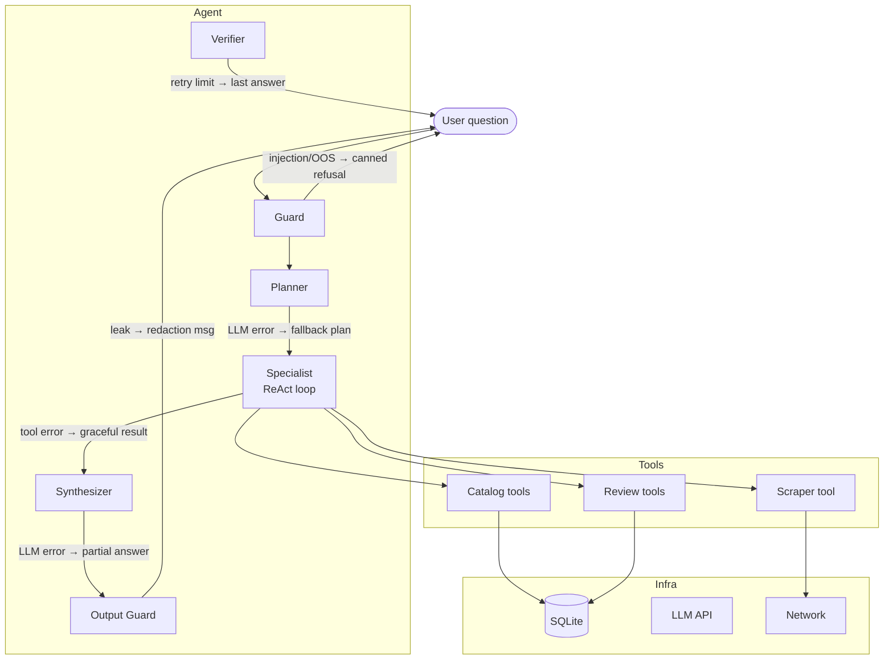

# Error Handling

> **Per-component failure modes, recovery strategies, and what the user/operator
> sees when something goes wrong.**

---

## Failure flow overview

---

## Component error matrix

### Guard (`agent/guard.py`)

| Failure | Behaviour | User sees |
|---|---|---|
| Regex pattern match (injection / OOS) | Returns canned refusal immediately; no LLM call | "I can only help with Petbarn products and reviews." |
| Pattern compilation error (coding bug) | Exception propagates; turn fails with generic error | Generic error message (see Synthesizer section) |

The Guard is the only node that intentionally **blocks** turns — all its
outcomes are deterministic and require no LLM.

---

### Planner (`agent/planner.py`)

| Failure | Behaviour | User sees |
|---|---|---|
| LLM API error (5xx, rate limit, timeout) | LangChain raises; caught in `graph.py`; fallback plan emitted with `catalog` specialist only | Answer may be less complete than optimal |
| LLM returns malformed JSON | `json.loads` fails; plan falls back to single catalog specialist | As above |
| LLM returns empty plan (no specialists) | Graph routes directly to Synthesizer with empty evidence | Synthesizer produces a graceful "I don't have enough data" answer |

---

### Specialist / ReAct loop (`agent/specialists/__init__.py`)

| Failure | Behaviour | User sees |
|---|---|---|
| Tool raises an unhandled exception | `create_react_agent` catches and returns error string as tool output; loop continues | Specialist may produce a partial answer; Synthesizer is told the tool failed |
| Tool returns `{"ok": false, ...}` | Structured error result treated as evidence; loop can retry or move on | Synthesizer explicitly states what failed (e.g. "live scraping was unavailable") |
| Scrape budget exhausted | `scrape_product` returns `{"error": "scrape_budget_exhausted"}` | Synthesizer notes that live data was not fetched and answers from existing DB data |
| Max iterations reached | ReAct loop stops; partial evidence forwarded to Synthesizer | Synthesizer answers with whatever was found so far |

---

### Catalog tools (`agent/tools/catalog.py`)

| Tool | Failure | Behaviour |
|---|---|---|
| `search_products` | DB query error | Returns `{"ok": false, "error": "db_error", "message": ...}` |
| `query_catalog` | SQL rejected by `sqlglot` validator (write statement, syntax error) | Returns `{"ok": false, "error": "invalid_sql", "message": "Only SELECT allowed"}` |
| `query_catalog` | SQL times out (> 5 s) | Returns `{"ok": false, "error": "query_timeout"}` |
| `get_price_history` | Product not in DB | Returns `{"ok": true, "history": []}` — empty, not an error |
| `compare_products` | One or both products not in DB | Returns `{"ok": false, "error": "product_not_found", "missing": [...]}` |

---

### Review tools (`agent/tools/reviews.py`)

| Tool | Failure | Behaviour |
|---|---|---|
| `get_review_stats` | Product has no BV data yet | Returns `{"ok": true, "stats": null, "message": "No review stats available"}` |
| `search_reviews` | Embeddings incompatible (model mismatch) | Automatically falls back to BM25-only; result includes `"search_mode": "bm25"` |
| `search_reviews` | DB vector query error | Falls back to BM25-only |
| `analyze_aspects` | No aspect rows for product | Returns `{"ok": true, "aspects": {}}` — empty dict, not an error |
| `get_product_qa` | No Q&A rows | Returns `{"ok": true, "qa": []}` |

All review tools are decorated with `@untrusted_tool` — any returned free
text carries `"untrusted": true` to prevent prompt-injection via review
content.

---

### Scraper tool (`agent/tools/scraper.py`)

| Failure | Behaviour | User sees |
|---|---|---|
| Budget exhausted | `{"ok": false, "error": "scrape_budget_exhausted", "message": "This turn already used N live scrape(s)..."}` | Synthesizer notes the limit was reached |
| Product not in catalog census | `{"ok": false, "error": "product_not_found"}` | Specialist cannot scrape unknown products |
| Network error (timeout, DNS) | `{"ok": false, "error": "network_error", "message": ...}` | Synthesizer falls back to DB data |
| Domain not in allowlist | `ValueError` → caught → `{"ok": false, "error": "domain_not_allowed"}` | Specialist cannot scrape external URLs |
| robots.txt disallows URL | `{"ok": false, "error": "robots_disallowed"}` | Specialist skips the URL |
| Rendered fetch fails (Playwright error) | Falls back to plain HTTP result, even if incomplete | Extraction may be partial |

---

### Synthesizer (`agent/synthesizer.py`)

| Failure | Behaviour | User sees |
|---|---|---|
| LLM API error | Exception propagates to `graph.py` runner; caught there | "Something went wrong generating a response. Please try again." |
| LLM returns empty response | Treated as a synthesis failure; generic error message shown | As above |
| Evidence dict is empty (all specialists failed) | Synthesizer receives an explicit "no evidence" notice; produces honest "I don't have data" answer | "I wasn't able to find information about that product." |

---

### Output Guard (`agent/graph.py` → `_output_leak_node`)

| Failure | Behaviour | User sees |
|---|---|---|
| Regex match on API key / PEM / JWT | Synthesizer answer replaced with redaction message; redaction is logged at WARNING | "⚠️ The response was redacted because it contained sensitive content." |
| Regex compilation error (coding bug) | Guard silently passes the answer through (fail-open for availability) | Original synthesizer answer |

The output guard is **fail-open** — if the scan itself errors, the answer is
passed through rather than blocking the user. This is a deliberate availability
trade-off; the input guard is the primary injection defence.

---

### Verifier (`agent/verifier.py`)

| Failure | Behaviour | User sees |
|---|---|---|
| LLM returns "ok" | Graph routes to END | Final synthesizer answer |
| LLM returns a critique | `_bump_retry_node` increments `retry_count`; graph re-runs Planner | User sees the improved re-synthesised answer |
| Retry limit reached (1) | Verifier critique is discarded; last synthesizer answer used | Potentially unverified answer, but never an infinite loop |
| LLM API error during verification | Exception caught; last synthesizer answer used as-is | As above |

The retry limit is deliberately set to 1 for a POC — enough to catch obvious
grounding errors without adding multiple LLM-call latency spikes.

---

### TieredFetcher / network layer (`scraping/fetch/tiered.py`)

| Failure | Behaviour | Logged as |
|---|---|---|
| HTTP 4xx (product removed) | `{"ok": false, "error": "http_4xx", "status": 404}` | `field_event` if product was previously ok |
| HTTP 5xx (server error) | Retry up to 3 × with exponential backoff; then error result | `scrape_run` row with `status = "error"` |
| Connection timeout | Same retry policy as 5xx | As above |
| robots.txt parse error | Treated as "allow all" (fail-open) | WARNING log |
| Playwright / rendered fetch failure | Falls back to plain HTTP content | DEBUG log |

---

### Database (`store/db.py`)

| Failure | Behaviour |
|---|---|
| `init_db()` fails on fresh install | Exception propagates; app shows a startup error |
| Write conflict (WAL mode) | SQLite WAL mode allows concurrent reads; writes retry automatically |
| Disk full | Exception propagates; scraper run recorded as `error`; app continues read-only |
| Schema migration needed | `db init` is idempotent — re-running it applies any new `CREATE TABLE IF NOT EXISTS` statements |

---

## Operator runbook (quick reference)

| Symptom | Check | Fix |
|---|---|---|
| All questions return "I wasn't able to find information" | `petbarn-intel report coverage` — is `products` table empty? | Run `petbarn-intel db init && petbarn-intel scrape census` |
| Agent traces show no specialist calls | Check Guard blocked turns on the Ops page | Review injection patterns in `agent/guard.py` |
| `search_reviews` always returns `"search_mode": "bm25"` | Embeddings model mismatch; check `review_embeddings.model_id` vs configured `embedding_model_id` | Re-run `petbarn-intel enrich embeddings` with matching model |
| Scraper returns `"domain_not_allowed"` | Product URL is not on `petbarn.com.au` | Normal — agent should not scrape external sites |
| Ops page shows many open incidents | Run `petbarn-intel report incidents` | Investigate field_events for the affected products; re-scrape if needed |
| Cost report shows LLM cost as 0 | Azure custom deployment name not in LiteLLM price registry | Set `cost_reference_model` in `.env` to a known public model with the same underlying family |
