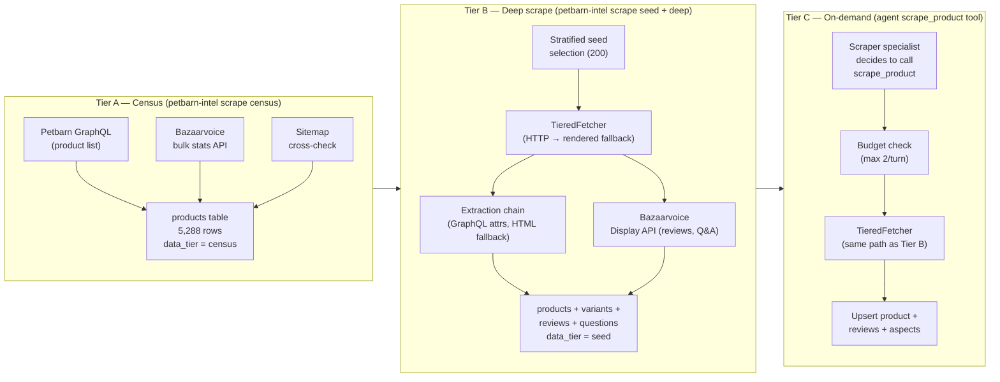
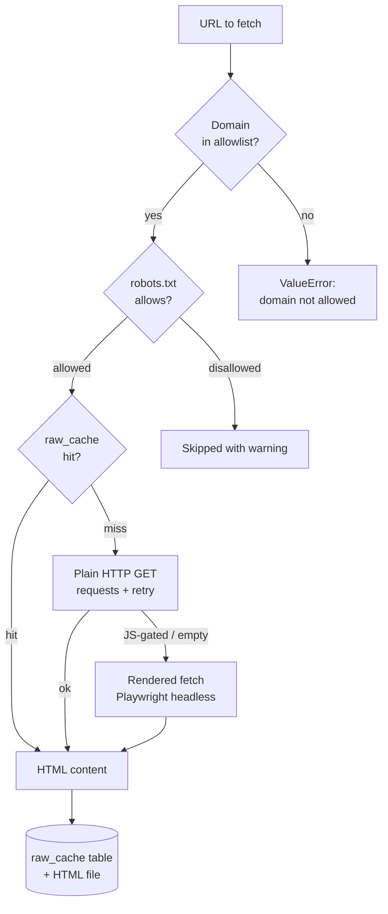

# Scraping Pipeline

> **How the repo discovers, fetches, parses, enriches, and maintains the
> Petbarn product and review dataset — from zero to 5 000+ products with
> full-text reviews and aspect-level sentiment.**

---

## Three-tier architecture

The pipeline is split into three tiers. Each tier can be run independently
with a CLI command, and they build on each other:

```
Tier A  ──►  Tier B  ──►  Tier C
Census       Deep-scrape   On-demand
(5,288)      (200 seed)    (any product,
                            mid-chat)
```



---

## Tier A — Catalog census

**Command:** `petbarn-intel scrape census`

Builds a complete product index **without** hitting individual product pages.
Three independent sources are fused:

### 1. Petbarn GraphQL API

The Petbarn website exposes an undocumented GraphQL endpoint used by its
React frontend. We call it with the same queries the frontend makes:

- `productSearch` — paginated product list with `name`, `brand`, `price`,
  `rating`, `reviewCount`, `url`, `petType`, `category`
- Attribute fields (variants, weight, availability) — fetched for the census
  so we know what _exists_ without a full HTML scrape

This avoids the overhead of rendering 5,000 HTML pages just to discover
product IDs. See [ADR 002](decisions/002-graphql-attrs-over-html.md) for the
rationale.

### 2. Bazaarvoice bulk statistics API

Bazaarvoice (the reviews platform Petbarn uses) has a public Display API
endpoint that returns **aggregate review statistics** for up to 100 products
per call:

```
GET https://api.bazaarvoice.com/data/statistics.json
    ?passKey=<display_key>
    &filter=ProductId:sku1,sku2,...
    &stats=reviews
```

This gives `TotalReviewCount`, `AverageOverallRating`, `RatingDistribution`
and `TotalQuestionCount` at scale, cheaply. The census runs this for every
product discovered via GraphQL to pre-populate `rating_value` and
`review_count` before any HTML is scraped.

The `passKey` is auto-discovered by inspecting the Petbarn homepage for
Bazaarvoice script tags — no hardcoding required (see `BVDisplayConfig`).

### 3. Sitemap cross-check

The Petbarn XML sitemap is parsed and its product URLs are cross-referenced
against the GraphQL result set. Any URL present in the sitemap but absent
from the GraphQL results is added as a census-only row, ensuring the catalog
is complete even if the GraphQL pagination misses edge cases.

---

## Tier B — Deep scrape

**Commands:**
```bash
petbarn-intel scrape seed --n 200   # select which 200 products to deep-scrape
petbarn-intel scrape deep           # run the deep scrape on the seed set
```

### Seed selection

200 products are selected from the census using a stratified sampling strategy:

| Stratum | Criteria | Count |
|---|---|---|
| Pet-type coverage | ≥ 1 product per pet type | ~8 |
| Low-rated | `rating_value < 3.5` | ~20 |
| High review count | top-N by `review_count` per category | ~80 |
| Broad brand coverage | diverse brand spread | ~92 |

The goal is a seed set that is _representative_, not just the top-50 most
popular products.

### TieredFetcher

`scraping/fetch/tiered.py` implements a two-level fetch strategy:



**Domain allowlist** — Only `petbarn.com.au` and `api.bazaarvoice.com` are
permitted. Any attempt to fetch an outside URL (e.g. injected via a review
body) raises a `ValueError` before the HTTP call is made.

**robots.txt** — Checked per-domain on first access, cached in process
memory. Paths disallowed by `robots.txt` are skipped with a warning log entry.

**Rate limiting** — A per-domain token bucket limits request rates. Default:
1 request / second for `petbarn.com.au`, 5 requests / second for the BV API.
The `SCRAPE_DELAY_MS` config key overrides this.

### Extraction chain

The deep scraper tries sources in order, falling back when the previous
source fails or returns incomplete data:

```
1. GraphQL attributes (product page API call) ──► most reliable
2. HTML structured-data (JSON-LD / microdata)  ──► medium reliability
3. LLM extraction fallback                     ──► last resort
```

**LLM fallback** (see `scraping/quality/llm_fallback.py`) is triggered when
both GraphQL and HTML extraction return `None` for a required field. It sends
a short HTML excerpt to the configured mini LLM and asks it to extract the
field value. The extracted value is stored with a `source = "llm_fallback"`
marker so it can be filtered out in quality reports.

This fallback exists because Petbarn occasionally changes its HTML structure,
and we prefer a potentially-imprecise LLM extraction over a NULL in the
database. See [ADR 002](decisions/002-graphql-attrs-over-html.md) for the
full tradeoff discussion.

### Bazaarvoice review collection

Reviews are fetched through the Bazaarvoice Display API rather than HTML
scraping:

```
GET https://api.bazaarvoice.com/data/reviews.json
    ?passKey=<key>
    &filter=ProductId:<sku>
    &include=products
    &sort=SubmissionTime:desc,Rating:asc
    &limit=100
```

**Stratified sampling** is applied per product:

| Bucket | Fraction | Rationale |
|---|---|---|
| Most-recent | 50 % | Captures current product state |
| Lowest-rating (1–2 ★) | 30 % | Ensures negative sentiment is represented |
| Most-helpful | 20 % | High-signal reviews (crowd-validated) |

Up to 100 reviews per product are stored. For the seed set of 200 products,
this yields ~10,363 reviews total.

---

## Tier C — On-demand scraping

When the agent's Scraper specialist calls `scrape_product`, it runs the same
Tier B deep-scrape path for a single product:

1. **Budget check** — `check_scrape_budget()` enforces
   `agent_max_live_scrapes_per_turn` (default 2). If the budget is exhausted,
   the tool returns `{"ok": false, "error": "scrape_budget_exhausted"}` and
   the specialist must work with existing data.

2. **Fetch and parse** — same `TieredFetcher` and extraction chain as Tier B.

3. **Upsert** — results are upserted (not inserted) so re-scraping a product
   that was already in the seed set updates rather than duplicates it.

4. **Cache invalidation** — the tool result cache (`agent/tools/cache.py`) is
   cleared after a successful scrape so subsequent tool calls in the same turn
   see fresh data.

---

## Enrichment pipeline

After raw scraping, two offline enrichment jobs run:

### Aspect-sentiment extraction

```bash
petbarn-intel enrich aspects
```

For each review body, sends a prompt to the mini LLM asking it to identify
which of the 7 aspects are mentioned and their sentiment. Results are inserted
into `review_aspects`. Runs in batches with a concurrency limit to stay within
rate limits.

### Embedding generation

```bash
petbarn-intel enrich embeddings --concurrency 25
```

Generates a 512-dim vector for each review body using the configured
embedding model. Results are stored in `review_embeddings` and the
`vec_reviews` virtual table is re-indexed.

Both jobs are idempotent — they skip rows that already have results, so they
can be re-run safely after partial failures.

---

## Data-quality monitoring

The scraper records quality signals throughout the pipeline:

| Signal | Table | CLI command |
|---|---|---|
| Scrape run status (ok / error) | `scrape_runs` | `petbarn-intel report coverage` |
| Per-field change events | `field_events` | Ops page "Data quality" tab |
| Missing-field / anomaly incidents | `incidents` | `petbarn-intel report incidents` |

An extraction coverage report (`petbarn-intel report coverage`) shows what
percentage of seed products have each field populated — useful for identifying
when a Petbarn HTML change has broken a field extractor.
